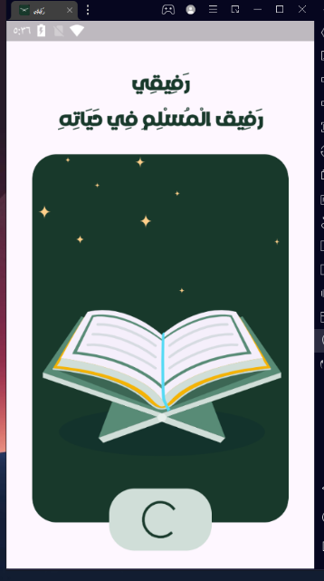
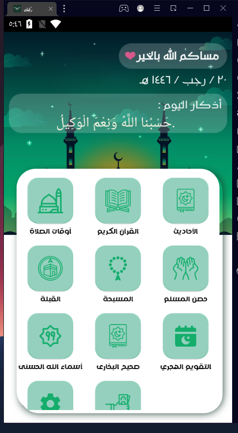
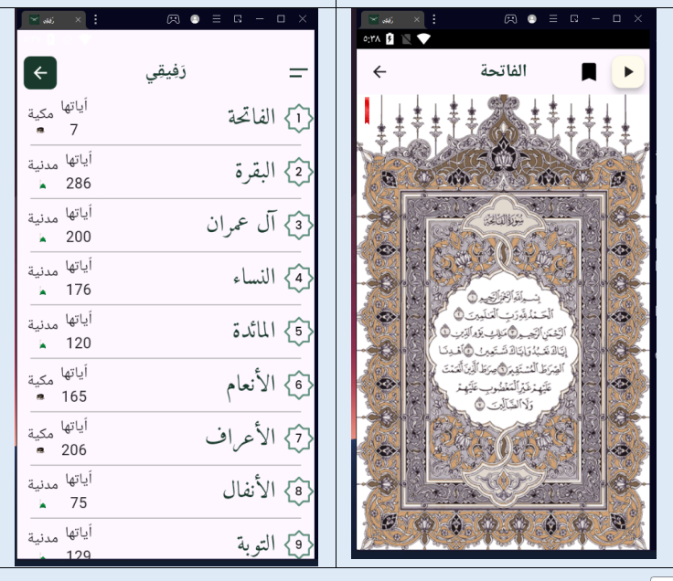
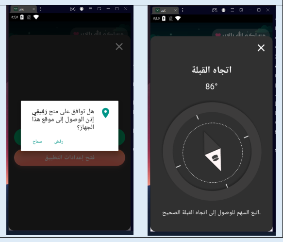
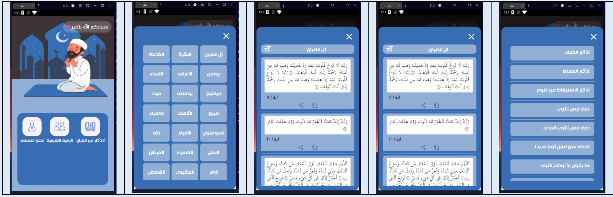
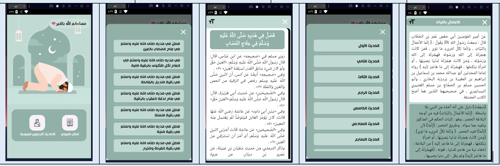
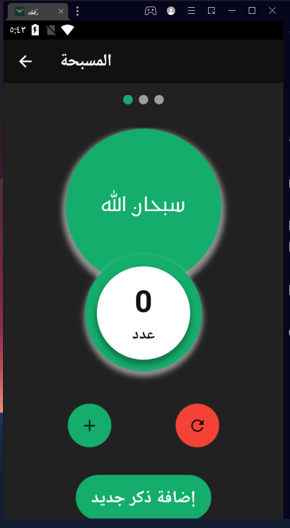
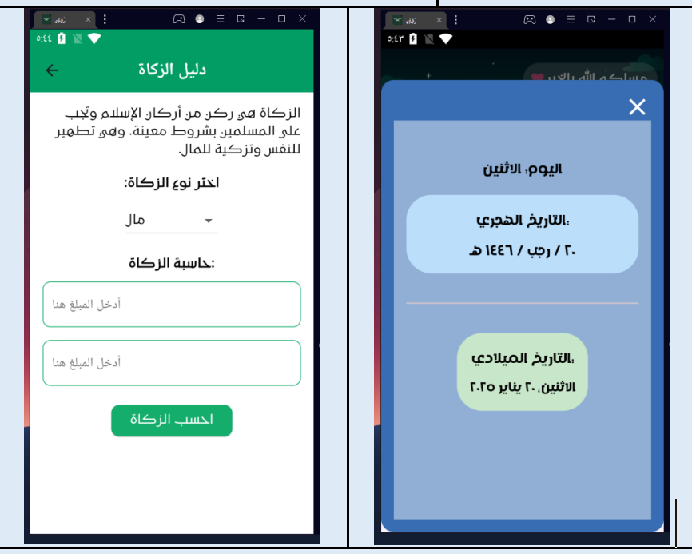
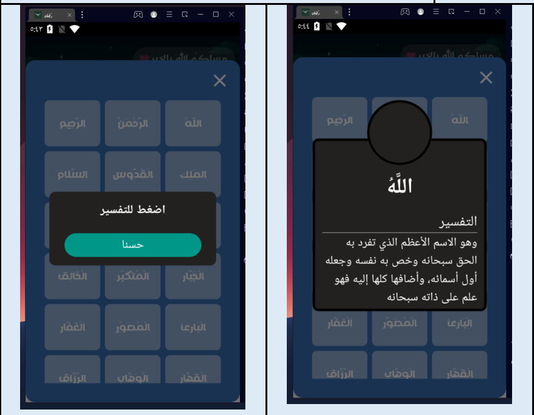

# Rafeqe App

## Rafeqe App  mockup

- Splash  screen

  
  
 - Home Screen
  
  

 - Prayer Time    
    
 
 
- Quran Karem Screen  

  

- Qibla Screen   

-  Hisn Screen 

-  Hadith Screen 

- Tasbeh  Screen 

- Zakat and Taqwem Screen 
 

- Asmaa Allah  Screen 
 

  
### Packages used in the project:

- [Dio](https://pub.dev/packages/dio)
- [internet_connection_checker](https://pub.dev/packages/internet_connection_checker)
- [equatable](https://pub.dev/packages/equatable)
- [dartz](https://pub.dev/packages/dartz)
- [bloc](https://pub.dev/packages/bloc)
- [flutter_bloc](https://pub.dev/packages/flutter_bloc)
- [flutter_localizations](https://pub.dev/packages/flutter_localization)
- [get_it](https://pub.dev/packages/get_it)
- [flutter_paypal_checkout](https://pub.dev/packages/flutter_paypal_checkout)
- [url_launcher](https://pub.dev/packages/url_launcher)
- [webview_flutter](https://pub.dev/packages/webview_flutter)

### in the project:

- Cubit as State managment
- Clean code
- MVVM

